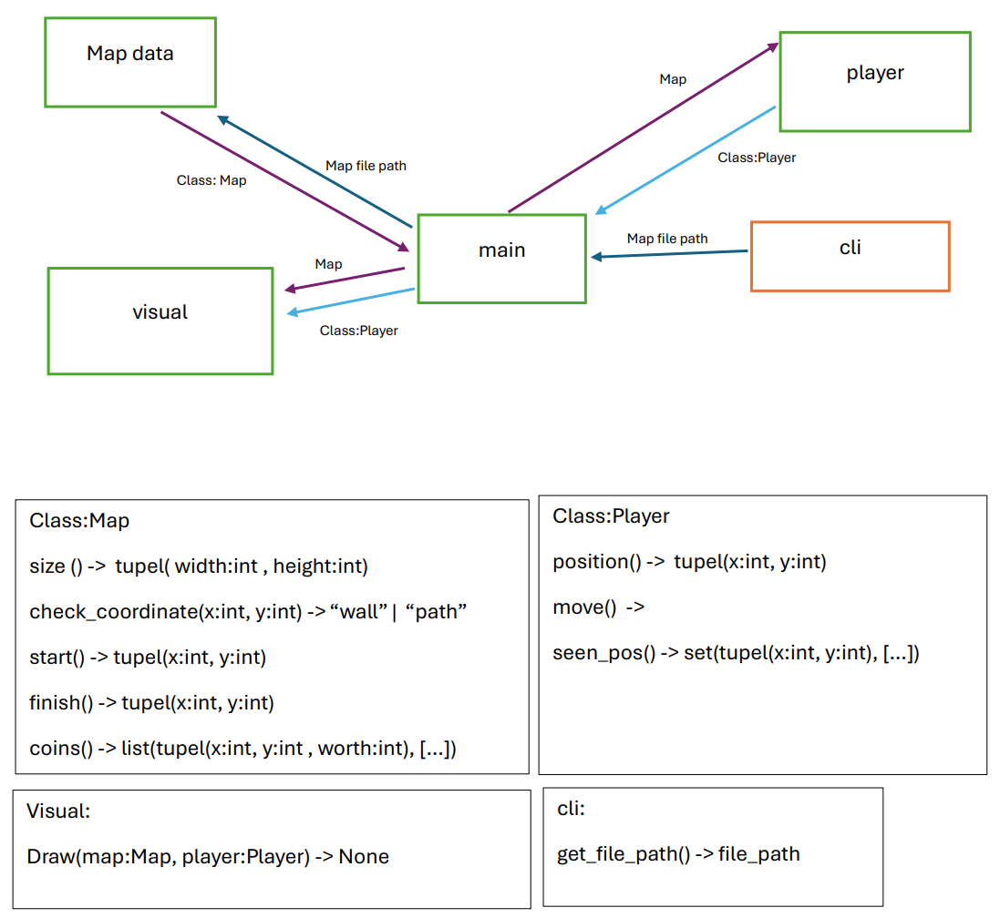

# Programmdokumentation:   == Versuch 3 == Labyrinth == SwEngG ==

*von Anna Degen, Marvin Horn, Diana Masyluk, Jakob Röhrborn*  
*Durchgeführt am 10.03.206*

---

## Inhaltsverzeichnis
1. [Einleitung und Aufgabenstellung](#1-einleitung-und-aufgabenstellung)
2. [Herangehensweise und Planung](#2-herangehensweise-und-planung)
3. [Aufbau und Modularisierung](#3-aufbau-und-modularisierung)
    - [Modulübersicht](#modulübersicht)
    - [Map](#map)
    - [Player](#player)
    - [Visuals](#visuals)
    - [CLI](#cli)
    - [Main](#main)
4. [Programmablauf](#4-programmablauf)
5. [Analyse aufgetretener Probleme](#5-analyse-aufgetretener-probleme)
6. [Verbesserungsvorschläge zur eigenen Arbeit](#6-verbesserungsvorschläge-zur-eigenen-arbeit)
7. [Quellenangaben](#7-quellenangaben)

---

## 1. Einleitung und Aufgabenstellung
Ziel dieses Projektes war die Entwicklung eines Python-Programms, welches in der Lage ist, Labyrinthe aus einfachen Textdateien einzulesen, grafisch darzustellen und durch einen autonomen Avatar (den "Spieler") selbstständig lösen zu lassen. Das Labyrinth wird dabei als zweidimensionales Gitter interpretiert, in welchem Start- und Zielpunkte, begehbare Pfade, Hindernisse (Wände) sowie sammelbare Objekte (Münzen) definiert sind. Die Visualisierung erfolgt über eine bereitgestellte Grafik-Bibliothek (`gfx_stack`). Das unser Programm sollte außerdem dazu in der Lage sein, unterschiedliche Labyrinthdateien über die Kommandozeile entgegenzunehmen.

## 2. Herangehensweise und Planung
Um eine reibungslose Zusammenarbeit zu gewährleisten, haben wir zuerst den Aufbau unseres Programms geplant. Dafür haben wir die Aufgaben in Module aufgeteilt und gemeinsam überlegt, welche Anforderungen an das jeweiligen Modul zu stellen sind, welche Eingaben das Modul von anderen benötigt und was es den anderen Modulen zur verfügung stellen kann. Außerdem haben wir die konkreten Schnittstellen in diesem Schritt festgelegt. Zum Festhalten unserer Ergebnisse haben wir dabei das folgende Diagramm erstellt.

## 3. Aufbau und Modularisierung

### Modulübersicht
Um eine hohe Wartbarkeit und Lesbarkeit des Codes zu gewährleisten, wurde das Programm in logische Module unterteilt (Separation of Concerns). Die Logik trennt sich in folgende Kernkomponenten:
- **Modellierung (`map.py`, `player.py`):** Repräsentation der Spielwelt und des Zustands des Avatar. Die Daten werden mithilfe von Klassen objektorientiert gespeichert.
- **Visualisierung (`visuals.py`):** Ausschließlich für die Darstellung der aktuellen Zustände zuständig. Um unnötige Komplexität zu vermeiden, wurde dieses Modul zustandsfrei entworfen.
- **Steuerung (`main.py`, `cli.py`):** Initialisierung der Komponenten, Verarbeitung von Benutzereingaben beim Programmstart, Kommunikation zwischen den Modulen und Taktung der Hauptschleife (Game Loop).

### Map
Dieses Modul ist für das Einlesen und Parsen der Labyrinth-Textdatei verantwortlich. Es übersetzt die rohen Textzeichen in eine interne, zweidimensionale Datenstruktur (verschachtelte Liste). Es verwaltet die Koordinaten für Start, Ziel sowie Münzen und bietet eine Methode zur Überprüfung von Koordinaten (inklusive einer integrierten Randprüfung, die ein Verlassen des Gitters verhindert).

### Player
Hier wird der Zustand des Avatars gespeichert. Dazu gehören: aktuelle Position, Blickrichtung und die Menge der bereits besuchten Felder. Das Modul enthält zudem den eigentlichen Wegfindungsalgorithmus (Rechte-Hand-Regel): Die move()-Funktion berechnet basierend auf der aktuellen Rotation und den Informationen der Karte autonom den nächsten gültigen Schritt des Avatars.

### Visuals
Das Modul nimmt als Schnittstelle Instanzen von Map und Player entgegen. Es iteriert über das Gitter und zeichnet über die gfx_stack-Bibliothek Wände, begehbare Pfade, Start/Ziel, Münzen sowie die Historie der vom Avatar besuchten Felder und seine aktuelle Position farblich kodiert auf das Fenster.

### CLI
Umfasst das Command-Line-Interface. Durch die Nutzung der Bibliothek argparse ermöglicht dieses Modul ein dynamisches Einlesen von Argumenten beim Programmstart, sodass verschiedene Dateipfade für unterschiedliche Labyrinth-Layouts mit der `-f` oder `--file` Flagge übergeben werden können.

### Main
Fungiert als zentraler Controller des gesamten Programms. Dieses Modul ruft die CLI-Parameter ab, instanziiert die Karte und den Spieler und startet das Grafikfenster. Kernbestandteil ist die while-Schleife, die solange läuft, bis das Fenster geschlossen wird. Sie koordiniert fortlaufend das Neuladen der Grafik (`visuals.draw(...)`), triggert die Bewegung des Spielers (`player.move(...)`) und gibt Ressourcen beim Beenden wieder frei.

## 4. Programmablauf
Der generelle Lebenszyklus des Programms folgt einem klaren, linearen Setup-Prozess, der in eine endlose Ereignisschleife übergeht:

1.  **Start:**  
Aufruf der `main.py` über die Kommandozeile.

2.  **Konfiguration:**  
Auslesen der Kommandozeilenargumente (`cli.py`). Ist ein Dateipfad gegeben, wird dieser verwendet, andernfalls greift ein Fallback auf ein Standard-Labyrinth.

3.  **Initialisierung:**  
    - Die Instanz der `Map` wird erzeugt. Hierbei wird die Labyrinthdatei ausgelesen und in die interne Datenstruktur überführt.
    - Die Instanz des `Player` wird erzeugt und auf den Startpunkt der Map gesetzt.
    - Das Grafikfenster (`gfx_stack`) wird dynamischen basierend auf den Dimensionen der Map initialisiert.  

4.  **Hauptschleife (Game Loop):**  
Solange das Programmfenster nicht geschlossen wird:
    - Der aktuelle Zustand von Map und Player wird gerendert (`visuals.draw(...)`).
    - Es wird geprüft, ob die Position des Spielers dem Ziel entspricht. Ist dies nicht der Fall, berechnet der Spieler seinen nächsten Schritt (`player.move(...)`).
    - Anschließend wird die Ereignisverarbeitung der Grafikbibliothek aufgerufen.

5.  **Ende (Graceful Shutdown)**  
Das Programm schließt sich ordnungsgemäß und räumt die grafischen Ressourcen auf, sobald die Schleife verlassen wird.

## 5. Analyse aufgetretener Probleme

Da die Anforderungen an das Programm relativ einfach waren, sind keine besonderen Probleme bei uns Aufgetreten.
Teilweise waren wir uns der genauen Anforderungen unsicher, da die Aufgabenstellung in manchem Punkten Interpretationsspielraum offenlässt.
Dazu gehörten unter anderem:

- Was soll passieren, wenn der Avatar das Ziel erreicht?
- In welche Richtung soll der Avatar zu beginn des Programms schauen? Durch die verwendung der *Rechte-Hand-Methode* kommt es z.B. in `Labyrinth-2.txt` dazu, dass eine Endlosschleife entsteht, wenn der Avatar zu Beginn des Programms nach oben schaut.
- Dürfen Teilaufgaben tatsächlich unter keinen Umständen miteinander in einem Modul verknüpft werden, wie es aus Punkt *3 Versuchsaufgabe* der Aufgabenstellung hervorgeht, selbst wenn dies die gesamte Struktur unhandlicher macht?

Keine dieser Probleme hielt uns allerdings von der Fertigstellung der Aufgabe ab. Es wäre nur Hilfreich gewesen zu wissen, was genau von unserem Programm während dem Versuch erwartert wird.

## 6. Verbesserungsvorschläge zur eigenen Arbeit

Als Verbesserungen an unserem Programm könnte man vorallem die restlichen Bonusaufgaben implementieren. Dazu sind uns auch noch folgende weitere Verbesserungen eingefallen:

- **Implementierung der Münz-Logik:** Momentan werden Münzen ("Coins") aus der Textdatei geparst und visuell auf der Karte dargestellt. Der Avatar ignoriert diese jedoch bei der Wegfindung und beim Darüberlaufen werden sie nicht "eingesammelt". Denkbar wäre hier, dass der Avatar statdessen versucht, alle Münzen aufzusammeln, bevor er sich zum Ziel bewegt.

- **Visuelles Feedback beim Ziel:** Sobald das Ziel erreicht ist, stoppt die Berechnung. Ein visuelles Feedback (z.B. eine kleine Animation oder ein Farbwechsel des gelaufenen Pfades) würde die Anschaulichkeit verbessern.
- **Loop-Prävention:** In Labyrinthen, die kreisförmige Pfade ohne Anschluss an Wände besitzen (Inseln), gerät die Rechte-Hand-Regel in eine Endlosschleife. Ein Erkennungsmechanismus für solche Loops wäre notwendig, um auch komplexere Graphen vollständig abzusichern.

## 7. Quellenangaben
- Für die Bearbeitung des Projekts wurden kein weiterer Fremder Quellcode verwendet, außer die im Quellcode-Framework bereitgestellten Bibiliotheken `pygame` und `argparse`
- Es wurde keine generative KI für das Schreiben des Quellcodes verwendet